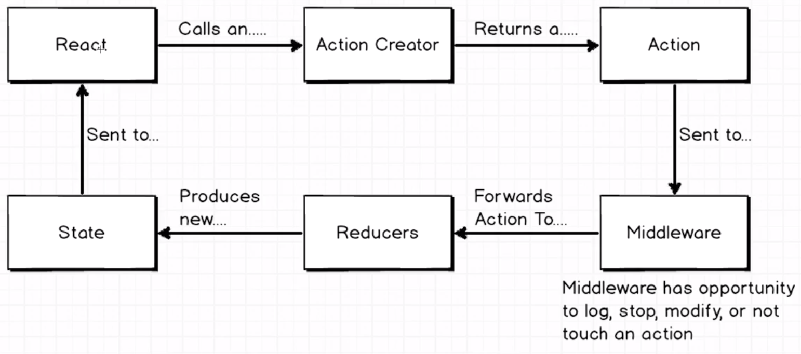
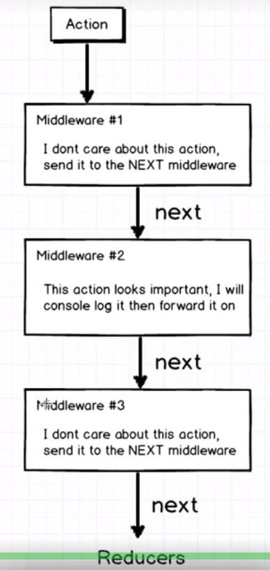
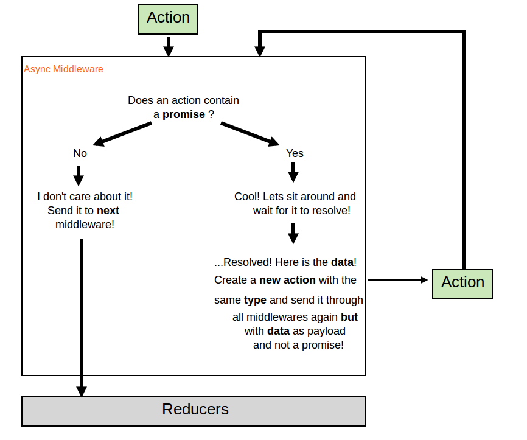

## Middleware

### Cycle in react-redux apps



### What is Middleware

**Middleware** sits between actions creators and reducers! Anything you want to do (any modifications), you can do it in middleware.

Middleware will help resolve any action before it hits to reducers.

```js
// pseudo code
//middleware pattern
export default function({ dispatch }) {
  return next => action => {
    // here we have all the actions which flows to our app
    // if action does not have a payload or not a promise
    if (!action.payload  .....) { // some other condition
      //send it to next middleware
      next(action);
    }
    //if it is a promise , resolve it , do some logic etc and dispatch new action with current data plus new data from response
     action.payload.then ....
      dispatch(newAction)
  }
}

```
The object being destructured ```({ dispatch })``` is actually the redux store object which also has the ```getState``` method on it. This is what makes middlewares so useful / powerful.

And, an easy way to see/understand the chain of functions is that, in the end, we just have a function with access to store (or dispatch on this case), the next middleware and the current action on its scope.

<br />
### Middleware stack (example with some 3 middlewares)



<br />
### Handling actions via middleware



<br />

### Steps to remember:
1. Pass your middleware to the ```applyMiddleware``` [L11](https://github.com/heron2014/middleware-react-redux/blob/master/src/index.js#L11) at your top level file
2. If we have more than one middleware just pass them like this: ```applyMiddleware(Middleware1,Middleware2, Middleware3)(createStore)```
3. Depending on the action which flows to middleware either send to to next middleware or dispatch an action with the resolved promise (data) (DIAGRAM ABOVE) [async](https://github.com/heron2014/middleware-react-redux/blob/master/src/middlewares/async.js)

### Run the example

- ```clone the repo```
- ```npm install```
- ```npm run start```
- navigate to ```localhost:8080```


### Reference
- ReduxReactSimpleStarter https://github.com/StephenGrider/ReduxSimpleStarter
- fake json api https://jsonplaceholder.typicode.com/
- axios
